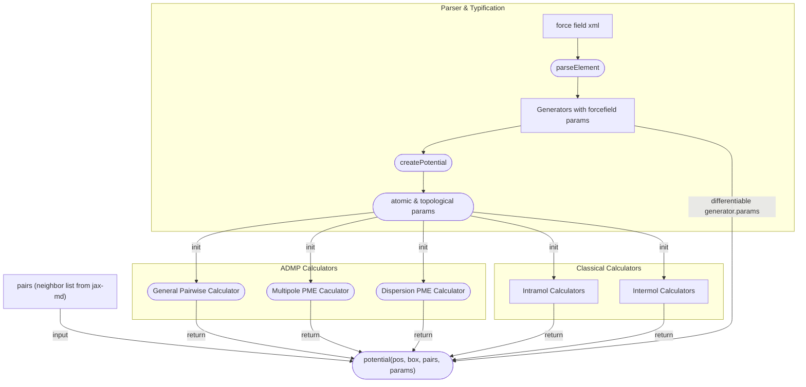
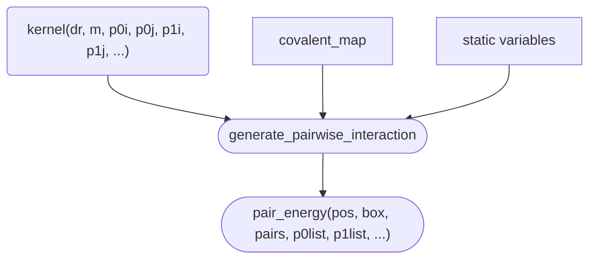
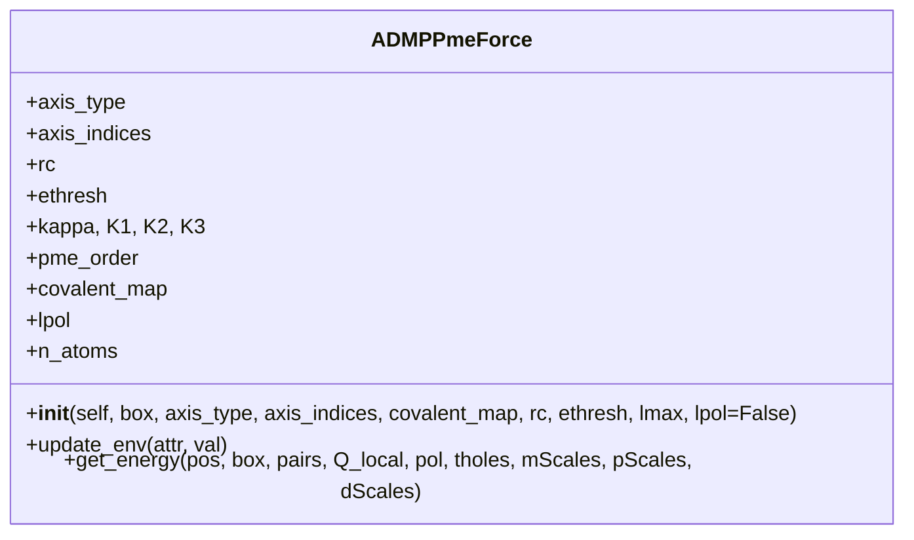

``` Mermaid
classDiagram
	class ADMPDispPmeForce
	ADMPDispPmeForce : +kappa, K1, K2, K3
	ADMPDispPmeForce : +pme_order
	ADMPDispPmeForce : +rc
	ADMPDispPmeForce : +ethresh
	ADMPDispPmeForce : +pmax
	ADMPDispPmeForce : +covalent_map
	ADMPDispPmeForce : +__init__(self, box, covalent_map, rc, ethresh, pmax)
	ADMPDispPmeForce : +update_env(attr, val)
	ADMPDispPmeForce : +get_energy(positions, box, pairs, c_list, mScales)
```


