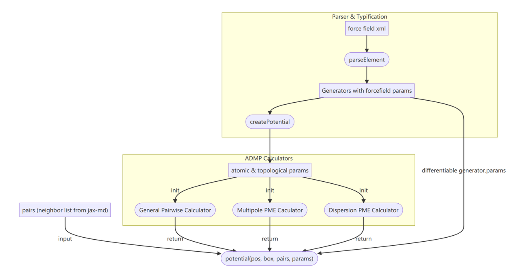

# Architecture of DMFF



The overall architechture of DMFF can be divided into two parts: 1. parser & typing and 2. calculators. 
We usually refer to the former as the *frontend* and the latter as the *backend* for ease of description.

DMFF introduces different forms of force fields in a modular way. For each force field form 
(in OpenMM, each form is also called a `Force`), there is a frontend module and a backend module. 
The frontend module is responsible for input file parsing, molecular topology construction, atom typification, 
and dispatching the forcefield parameters into the atomic parameter; The backend module is the calculation kernel, 
which calculates the energy & force of the system, using particle positions and atomic parameters as inputs.

In the design of the frontend modules, DMFF reuses the frontend parser from OpenMM for topology analysis. 
The core class in frontend is the `Generator` class, which should be defined for each force field form. 
All frontend `Generators` are currently put in `api.py` and are called by the top-level `Hamiltonian` class.

The backend module is usually an automatically differentiable calculator built with Jax. 

The structures of the frontend and the backend modules will be introduced in detail in below.

## How Frontend Works

Frontend modules are stored in `api.py`. `Hamiltonian` class is the top-level class exposed to users by DMFF. 
`Hamiltonian` class reads the path of the XML file, parses the XML file, and calls different frontend modules 
according to the `*Force` tags found in XML. The frontend generator has the same form as the OpenMM's generators 
[forcefield.py](https://github.com/openmm/openmm/blob/master/wrappers/python/openmm/app/forcefield.py). 
The `Generator` class parses the corresponding XML tag to obtain the force field parameters, 
then use the parameters to initialize the backend calculator. 
It also provides the interface to wrap the backend calculators into potential functions, 
which are eventually returned to the users.

When users use DMFF, the only thing they need to do is to initilize the the `Hamiltonian` class. 
In this process, `Hamiltonian` will automatically parse and initialize the corresponding potential function 
according to the tags in XML. The call logic is shown in the following chart. 
The box represents the command executed in Python script, 
and the rounded box represents the internal operation logic of OpenMM when executing the command.



### Hamiltonian Class

The `Hamiltonian` class is the top-level frontend module, which inherits the 
[forcefield class](https://github.com/openmm/openmm/blob/master/wrappers/python/openmm/app/forcefield.py) in OpenMM. 
It is responsible for parsing the XML force field files and generating potential functions to calculate system energy 
with the given topology information. First, the usage of the `Hamiltonian` class is given:


```python
H = Hamiltonian('forcefield.xml')
app.Topology.loadBondDefinitions("residues.xml")
pdb = app.PDBFile("waterbox_31ang.pdb")
rc = 4.0
# generator stores all force field parameters
generators = H.getGenerators()
disp_generator = generators[0]
pme_generator = generators[1]

potentials = H.createPotential(pdb.topology, nonbondedCutoff=rc*unit.angstrom)
# pot_fn is the actual energy calculator
pot_disp = potentials[0]
pot_pme = potentials[1]
```

`Hamiltonian` class performs the following operations during instantiation:

* read Residue tag in XML, generate Residue template;
* read AtomTypes tag, store AtomType of each atom;
* for each Force tag, call corresponding `parseElement` method in `app.forcefield.parser` to parse itself, and register `generator`.

`app.forcefield.parser` is a `dict`, the keys are Force tag names, and the values are the `parseElement` method 
of the corresponding `generator`. When `Hamiltonian` parses the XML file, it will use the tag name to look up the 
corresponding `parseElement` method, then calls it to initialize the `generator` instance, which stores the raw 
parameters from the XML file. You can access all the generators by the `getGenerators()` method in Hamiltonian. 


### Generator Class


The generator class is in charge of input file analysis, molecular topology construction, atom classification, 
and expanding force field parameters to atomic parameters. It is a middle layerthat links `Hamiltonian` with the backend. 
See the following chart for its design logic:


In a custom generator one must define the following methods:


* @staticmethod parseElement(element, hamiltonian): OpenMM uses `element.etree` to parse tags in XML file, 
and the first argument `element` is an `Element` object. For instance, if there were a section in XML file 
that defines a harmonic bond stretching potential:

```xml
  <HarmonicJaxBondForce>
    <Bond type1="ow" type2="hw" length="0.0957" k="462750.4"/>
    <Bond type1="hw" type2="hw" length="0.1513" k="462750.4"/>
  </HarmonicJaxBondForce>
```

This input will be converted into an `Element` object first and be passed to the `HarmonicBondJaxGenerator.parseElement` 
method, which should have been registered in `app.forcefield.parsers["HarmonicBondForce"]`.
The developer needs to define the `parseElement` method to parse the input `Element` object and to initialize the generator itself.
For example, in this case, you can use `element.findall("Bond")` to get an iterator that iterates over all the <Bond\> tags. 
Then you can use `.attrib` to access all the properties (`type1`, `type2`, `length`, and `k`) within each <Bond\> tag in `dict` format. 
These properties, as force field parameters, can be classified into two categories. The first category is differentiable parameters 
(such as `length` and `k`), which may be subject to further optimization. By design, these parameters should be fed into the potential 
function as explicit input arguments. Therefore, these parameters should be gathered in a `dict` object named `params`, which is then 
saved as an attribute of the `generator`. The second category is non-differentiable variables (such as `type1` and `type2`): it is 
unlikely that you are going to optimize them, so they are also called *static* variables. These variables will be used by the potential 
function implicitly and not be exposed to the users. Therefore, you may save them in `generator` at will, as long as they can be 
accessed by the potential function later.

  
* `createForce(self, system, data, nonbondedMethod, *args)` pre-process the force field parameters from XML, and use them to initialize
the backend calculators, then wrap the calculators using a potential function and returns it. 
`System` and `data` are given by OpenMM's forcefield class, which store topology/atomType information (for now you need to use 
debug tool to access). Bear in mind that we should not break the derivative chain from the XML raw data (force field parameters) 
to the per-atom properties (atomic parameters). So we should do the parameter dispatch (i.e., dispatching force field parameters to 
each atom) within the returned potential function. Therefore, in `createForce`, we usually only construct the atomtype index map using 
the information in `data`, but do not dispatch parameters! The atomtype map will be used in potential function implicitly, to dispatch
parameters.

Here is an example:

```python
map_atomtype = np.zeros(n_atoms, dtype=int)

for i in range(n_atoms):
    atype = data.atomType[data.atoms[i]]
    map_atomtype[i] = np.where(self.types == atype)[0][0]
```

Finally, we need to bind the calculator's compute function to `self._jaxPotential`, which is the final potential function (`potential_fn`) 
returned to users:


```python
            
def potential_fn(positions, box, pairs, params):
    isinstance_jnp(positions, box, params)
    return bforce.get_energy(
        positions, box, pairs, params["k"], params["length"]
    )

self._jaxPotential = potential_fn
```

The `potential_fn` function only takes `(positions, box, pairs, params)` as explicit input arguments. All these arguments except
`pairs` (neighbor list) should be differentiable. A helper function `isinstance_jnp` in `utils.py` can check take-in arguments whether they are `jnp.array`. Non differentiable parameters are passed into it by closure (see code convention section). 
Meanwhile, if the generator needs to initialize multiple calculators (e.g. `NonBondedJaxGenerator` will call both `LJ` and `PME` calculators), 
`potential_fn` should return the summation of the results of all calculators. 

Here is a pseudo-code of the frontend module, demonstrating basic API and method

```python
from openmm import app

class SimpleJAXGenerator:
    
    def __init__(self, hamiltonian):
        self.ff = hamiltonian
        self.params = None
        self._jaxPotential = None
        init_other_attributes_if_needed
        
    @staticmethod
    def parseElement(element, hamiltonian):
        parse_xml_element
        generator = SimpleGenerator(hamiltonian, args_from_xml)
        hamiltonian.registerGenerator(generator)
        
    def createForce(self, sys, data, nonbondedMethod, nonbondedCutoff, args):
        generate_constraints_if_needed
        # Create JAX energy function from system information
        create_jax_potential
        self._jaxPotential = jaxPotential
        
    def getJaxPotential(self, data, **args):
        return self._jaxPotential
        
    def renderXML(self):
        # render_xml_forcefield_from_params
        
        
app.parsers["SimpleJAXForce"] = SimpleJAXGenerator.parseElement

class Hamiltonian(app.ForceField):

    def __init__(self, **args):
        super(app.ForceField, self).__init__(self, **args)
        self._potentials = []
        
    def createPotential(self, topology, **args):
        system = self.createSystem(topology, **args)
        load_constraints_from_system_if_needed
        # create potentials
        for generator in self._generators:
            potentialImpl = generator.getJaxPotential(data)
            self._potentials.append(potentialImpl)
        return [p for p in self._potentials]
```

And here is a HarmonicBond potential implement:

```python
class HarmonicBondJaxGenerator:
    def __init__(self, hamiltonian):
        self.ff = hamiltonian
        self.params = {"k": [], "length": []}
        self._jaxPotential = None
        self.types = []

    def registerBondType(self, bond):

        types = self.ff._findAtomTypes(bond, 2)
        # self.ff._findAtomTypes is a function implemented in OpenMM to patch 
        # atom types. The first argument is xml element. The second argument is 
        # the number of types needed to be patched. 
        # The return of this function is:
        # [[atype1, atype2, ...], [atype3, atype4, ...], ...]
        # When patching by atom types, the function would return a list with 
        # patched atom types. When patching by atom classes, the function would 
        # return a list with all the atom types patched to the class.
        
        self.types.append(types)
        self.params["k"].append(float(bond["k"]))
        self.params["length"].append(float(bond["length"]))  # length := r0

    @staticmethod
    def parseElement(element, hamiltonian):
        # Work with xml tree. Element is the node of forcefield.
        # Use element.findall and element.attrib to get the 
        # children nodes and attributes in the node.
            
        generator = HarmonicBondJaxGenerator(hamiltonian)
        hamiltonian.registerGenerator(generator)
        for bondtype in element.findall("Bond"):
            generator.registerBondType(bondtype.attrib)

    def createForce(self, system, data, nonbondedMethod, nonbondedCutoff, args):
        # jax it!
        for k in self.params.keys():
            self.params[k] = jnp.array(self.params[k])
        self.types = np.array(self.types)

        n_bonds = len(data.bonds)
        # data is the data structure built by OpenMM, saving topology information of the system.
        # The object maintains all the bonds, angles, dihedrals and impropers.
        # And it also maintains the atomtype of each particle.
        # Use data.atoms, data.bonds, data.angles, data.dihedrals, data.impropers 
        # to get the atom types.
        map_atom1 = np.zeros(n_bonds, dtype=int)
        map_atom2 = np.zeros(n_bonds, dtype=int)
        map_param = np.zeros(n_bonds, dtype=int)
        for i in range(n_bonds):
            idx1 = data.bonds[i].atom1
            idx2 = data.bonds[i].atom2
            type1 = data.atomType[data.atoms[idx1]]
            type2 = data.atomType[data.atoms[idx2]]
            ifFound = False
            for ii in range(len(self.types)):
                if (type1 in self.types[ii][0] and type2 in self.types[ii][1]) or (
                    type1 in self.types[ii][1] and type2 in self.types[ii][0]
                ):
                    map_atom1[i] = idx1
                    map_atom2[i] = idx2
                    map_param[i] = ii
                    ifFound = True
                    break
            if not ifFound:
                raise BaseException("No parameter for bond %i - %i" % (idx1, idx2))
        
        # HarmonicBondJaxForce is the backend class to build potential function
        bforce = HarmonicBondJaxForce(map_atom1, map_atom2, map_param)

        # potential_fn is the function to call potential, in which the dict self.params
        # is fed to harmonic bond potential function
            
        def potential_fn(positions, box, pairs, params):
            return bforce.get_energy(
                positions, box, pairs, params["k"], params["length"]
            )

        self._jaxPotential = potential_fn
        # self._top_data = data

    def getJaxPotential(self):
        return self._jaxPotential

# register all parsers
app.forcefield.parsers["HarmonicBondForce"] = HarmonicBondJaxGenerator.parseElement
```

    After the calculation and optimization, we need to save the optimized parameters as XML format files for the next calculation. This serialization process is implemented through the `renderXML` method. At the beginning of the `api.py` file, we provide nested helper classes called `XMLNodeInfo` and `XMLElementInfo`. In the XML file, a `<HarmonicJaxBondForce>` and its close tag is represented by XMLNodeInfo and the content element is controlled by `XMLElementInfo`

```
  <HarmonicJaxBondForce>
    <Bond type1="ow" type2="hw" length="0.0957" k="462750.4"/>
    <Bond type1="hw" type2="hw" length="0.1513" k="462750.4"/>
  </HarmonicJaxBondForce>
```

    When we want to serialize optimized parameters from the generator to a new XML file, we first initialize a `XMLNodeInfo(name:str)` class with the potential name

```python
finfo = XMLNodeInfo("HarmonicBondForce")
```
    If necessary, you can add attributes to this tag using the `addAttribute(name:str, value:str)` method. Then we add the inner `<Bond>` tag by invoke `finfo.addElement(name:str, attrib:dict)` method. Here is an example to render `<HarmonicBondForce>`

```
    def renderXML(self):
        # generate xml force field file
        finfo = XMLNodeInfo("HarmonicBondForce")  # <HarmonicBondForce> and <\HarmonicBondForce>
        for ntype in range(len(self.types)):
            binfo = {}
            k1, v1 = self.typetexts[ntype][0]
            k2, v2 = self.typetexts[ntype][1]
            binfo[k1] = v1
            binfo[k2] = v2
            for key in self.params.keys():
                binfo[key] = "%.8f"%self.params[key][ntype]
            finfo.addElement("Bond", binfo)  # <Bond binfo.key=binfo.value ...>
        return finfo
```


## How Backend Works

### Force Class

Force class is the backend module that wraps the calculator function. 
It does not rely on OpenMM and can be very flexible. For instance, 
the Force class of harmonic bond potential is shown below as an example.

```python
def distance(p1v, p2v):
    return jnp.sqrt(jnp.sum(jnp.power(p1v - p2v, 2), axis=1))
    
class HarmonicBondJaxForce:
    def __init__(self, p1idx, p2idx, prmidx):
        self.p1idx = p1idx
        self.p2idx = p2idx
        self.prmidx = prmidx
        self.refresh_calculators()

    def generate_get_energy(self):
        def get_energy(positions, box, pairs, k, length):

            # NOTE: pairs array from jax-md has invalid index
            pairs = regularize_pairs(pairs)  
            buffer_scales = pair_buffer_scales(pairs)            

            p1 = positions[self.p1idx]
            p2 = positions[self.p2idx]
            kprm = k[self.prmidx]
            b0prm = length[self.prmidx]
            dist = distance(p1, p2)
            return jnp.sum(0.5 * kprm * jnp.power(dist - b0prm, 2) * buffer_scales)  # mask invalid pairs

        return get_energy

    def update_env(self, attr, val):
        """
        Update the environment of the calculator
        """
        setattr(self, attr, val)
        self.refresh_calculators()

    def refresh_calculators(self):
        """
        refresh the energy and force calculators according to the current environment
        """
        self.get_energy = self.generate_get_energy()
        self.get_forces = value_and_grad(self.get_energy)
```

The design logic for the `Force` class is: it saves the *static* variables inside the class as 
the *environment* of the real calculators. Examples of the static environment variables include:
the $\kappa$ and $K_{max}$ in PME calculators, the covalent_map in real-space calculators etc.
For a typical `Force` class,  one needs to define the following methods:

* `__init__`: The initializer, saves all the *static* variables.
* `update_env(self, attr, val)`: updates the saved *static* variables, and refresh the calculators
* `generate_get_energy(self)`: generate a potential calculator named `get_energy` using the current 
  environment.
* `refresh_calculators(self)`: refresh all calculators if environment is updated.
  
In ADMP, all backend calculators only take atomic parameters as input, so they can be invoked
independently in hybrid ML/force field models. The dispatch of force field parameters is done 
in the `potential_fn` function defined in the frontend. 

Please note that the `pairs` array accepted by `get_energy` potential compute kernel is **directly** construct from `jax-md`'s neighborList. 
To keep the shape of array neat and tidy, prevent JIT the code every time `get_genergy` is called, the `pairs` array is padded. It has 
some invalid index in the padding area, say, those `pair_index==len(positions)` is invalid padding pair index. That means there are many 
`[len(positions), len(positions)]` pairs in the `pairs` array, resulting in the distance equl to 0. The solution is we first call `regularize_pairs` 
helper function to replace `[len(positions), len(positions)]` with `[len(positions)-2, len(positions)-1]`, so the distance is always non-zeros. Due 
to we compute additional invalid pairs, we need to compute a `buffer_scales` to mask out those invalid pairs. We need to use `pair_buffer_scales(pairs)` 
to get the mask, and apply it in the pair energy array before we sum it up. 
