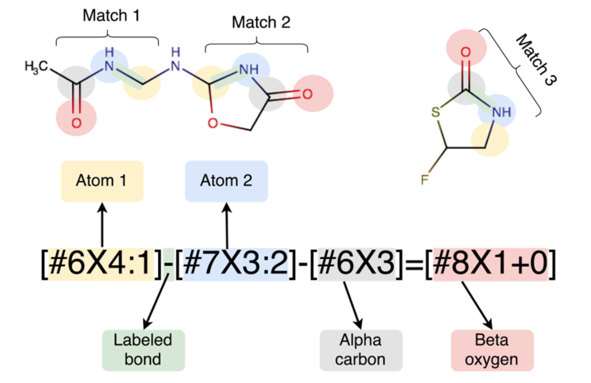
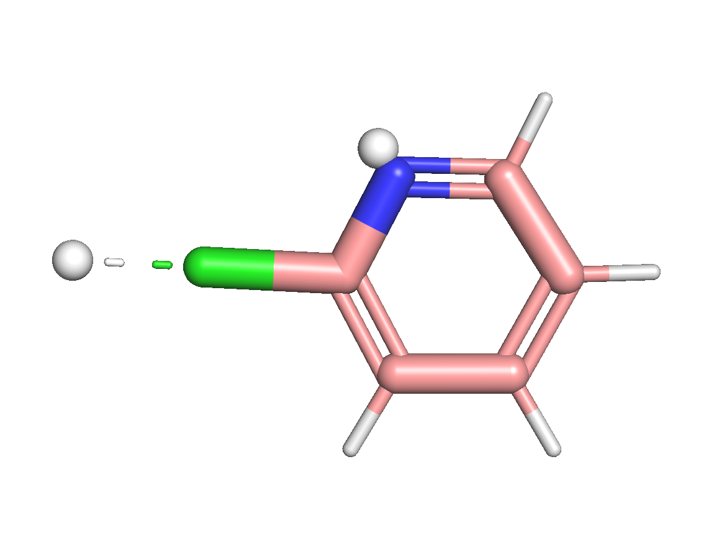

# 3. Basic usage
This chapter will introduce some basic usage of DMFF. All scripts can be found in `examples/` directory in which Jupyter notebook-based demos are provided. 
## 3.1 Compute energy
DMFF uses OpenMM to parse input files, including coordinates file, topology specification file and force field parameter file. Then, the core class `Hamiltonian` inherited from `openmm.ForceField` will be initialized and the method `createPotential` will be called to create differentiable potential energy functions for different energy terms. Take parametrzing an organic moleclue with GAFF2 force field as an example:
```python
import jax
import jax.numpy as jnp
import openmm.app as app
import openmm.unit as unit
from dmff import Hamiltonian, NeighborList

app.Topology.loadBondDefinitions("lig-top.xml")
pdb = app.PDBFile("lig.pdb")
ff = Hamiltonian("gaff-2.11.xml", "lig-prm.xml")
potentials = ff.createPotential(pdb.topology)
for k in potentials.dmff_potentials.keys():
    pot = potentials.dmff_potentials[k]
    print(pot)
```
In this example, `lig.pdb` is the PDB file containing atomic coordinates, and `lig-top.xml` specifying bond connections within a molecule and this information is required by `openmm.app` to generate molecular topology. Note that this file is not always required, if bond conncections are defined in .pdb file by `CONNECT` keyword. `gaff-2.11.xml` contains GAFF2 force field parameters (bonds, angles, torsion and vdW), and `lig-prm.xml` contains atomic partial charges (GAFF2 requests a user-defined charge assignment process). This xml format is compatitable with OpenMM definitions, and a detailed description can be found in [OpenMM user guide](`http://docs.openmm.org/latest/userguide/application/05_creating_ffs.html`) or [XML-format force fields](./xml_spec.md) section.

If you run this script in `examples/classical`, you will get the following output.
```
<function HarmonicBondJaxGenerator.createForce.<locals>.potential_fn at 0x112504af0>
<function HarmonicAngleJaxGenerator.createForce.<locals>.potential_fn at 0x1124cd820>
<function PeriodicTorsionJaxGenerator.createForce.<locals>.potential_fn at 0x18509b790>
<function NonbondJaxGenerator.createForce.<locals>.potential_fn at 0x18509baf0>
```
The force field parameters are stored as a Python dict in the Hamiltonian.
```python
params = ff.getParameters()
nbparam = params['NonbondedForce']
nbparam
```

```
{
    'sigma': DeviceArray([0.33152124, ...], dtype=float32),
    'epsilon': DeviceArray([0.4133792, ...], dtype=float32),
    'epsfix': DeviceArray([], dtype=float32),
    'sigfix': DeviceArray([], dtype=float32),
    'charge': DeviceArray([-0.75401515, ...], dtype=float32),
    'coulomb14scale': DeviceArray([0.8333333], dtype=float32),
    'lj14scale': DeviceArray([0.5], dtype=float32)
}
```


Each generated function will read coordinates, box, pairs and force field parameters as inputs.
```python
positions = jnp.array(pdb.getPositions(asNumpy=True).value_in_unit(unit.nanometer))
box = jnp.array([
    [10.0,  0.0,  0.0],
    [ 0.0, 10.0,  0.0],
    [ 0.0,  0.0, 10.0]
])
nbList = NeighborList(box, rc=4)
nbList.allocate(positions)
pairs = nbList.pairs
```
Note that in order to take advantages of the auto-differentiable implementation in JAX, the input arrays have to be `jax.numpy.ndarray`, otherwise DMFF will raise an error. `pairs` is a $N\times 2$ integer array in which each row specifying atoms condsidered as neighbors within `rcut`. As shown above, this can be calculated with `dmff.NeighborList` class which is supported by `jax_md`. 

The potential energy function will give energy (a scalar, in kJ/mol) as output:
```python
nbfunc = potentials.dmff_potentials['NonbondedForce']
nbene = nbfunc(positions, box, pairs, params)
print(nbene)
```
If everything works fine, you will get `-425.41412` as a result. In addition, you can also use `getPotentialFunc()` and `getParameters()` to obtain the whole potential energy function and force field parameter set, instead of seperated functions for different energy terms.
```python
efunc = potentials.getPotentialFunc()
params = ff.getParameters()
totene = efunc(positions, box, pairs, params)
```

## 3.2 Compute forces
Different from conventional programming frameworks, explicit definition of atomic force calculation functions are no longer needed. Instead, the forces can be evaluated in an automatic manner with `jax.grad`.
```
pos_grad_func = jax.grad(efunc, argnums=0)
force = -pos_grad_func(positions, box, pairs, params)
```

## 3.3 Compute parametric gradients
Similarly, the derivative of energy with regard to force field parameters can also be computed easily.
```python
param_grad_func = jax.grad(nbfunc, argnums=-1)
pgrad = param_grad_func(positions, box, pairs, params)
print(pgrad["NonbondedForce"]["charge"])
```

```python
[ 652.7753      55.108738   729.36115   -171.4929     502.70837
  -44.917206   129.63994   -142.31796   -149.62088    453.21503
   46.372574   140.15303    575.488      461.46902    294.4358
  335.25153     27.828705   671.3637     390.8903     519.6835
  220.51129    238.7695     229.97302    210.58838    231.8734
  196.40994    237.08563     35.663574   457.76416     77.4798
  256.54382    402.2121     611.9573     440.8465     -52.09662
  421.86688    592.46265    237.98883    110.286194   150.65375
  218.61087    240.20477   -211.85376    150.7331     310.89404
  208.65228   -139.23026   -168.8883     114.3645       3.7261353
  399.6282     298.28455    422.06445    526.18463    521.27563
  575.85767    606.74744    394.40845    549.84033    556.4724
  485.1427     512.1267     558.55896    560.4667     562.812
  333.74194  ]
```

## 3.4 Parametrize molecules with SMIRKS-based force field
### 3.4.1 Background
Besides atom-typing based methods, DMFF also support assigning force field parameters with [SMIRKS](https://www.daylight.com/dayhtml/doc/theory/theory.smirks.html). SMIRKS is an extenstion of [SMARTS](https://www.daylight.com/dayhtml/doc/theory/theory.smarts.html) language which allows users not only to specify chemical substructures with certain patterns, but also to numerically tag the matched atoms for assigning parameters. This approach avoid the duplicate atom-typing definition process, which enables new parameters to be easily introduced to existing force field parameters sets. [OpenFF](https://github.com/openforcefield/openff-toolkit)[<sup>[1-2]</sup>](#sminorff) series are examples of SMIRKS-based force fields for organic molecules.


<center>Fig. 1 Illustration of matching chemical substructures with SMIRKS language. Adapted from [[1]](#sminorff).</center>

### 3.4.2 Parametrize molecules with SMIRKS by DMFF
The SMIRKS pattern matching is supported by RDKit package, which can be install with conda:
```bash
conda install rdkit -c conda-forge
```
To begin with, we need a molecule encoded in `rdkit.Chem.Mol` object. As an example, we will load a N-methylacetamide molecule defined in `examples/smirks/C3H7NO.mol`:
```python
from rdkit import Chem
from dmff import Hamiltonian

mol = Chem.MolFromMolFile("C3H7NO.mol", removeHs=False) # hydrogens must be preserved
```
Then load force field parameters in xml format. Instuctions about how to write a SMIRKS-based force field XML file can be found in the [Chapter 4](xml_spec.md).

```python
h_smk = Hamiltonian("C3H7NO.xml", noOmmSys=True)
```
Note that the argument `noOmmSys` is set to `False` so that DMFF will not create an openmm system, as `openmm` does not support SMIRKS-based force field definitions.

Build an openmm topology and parametrize the molecule to create differentiable potential energy functions:
```python
top = h_smk.buildTopologyFromMol(mol)
potObj = h_smk.createPotential(top, rdmol=mol)
```
So far, we can utilize this `dmff.Potential` object to calculate energy and forces as we did in the previous sections.

### 3.4.3 Bond Charge Correction (BCC) and Virtual Sites
Bond charge correction[<sup>[3-4]</sup>](#bcc) is an approach to obtain high-accuracy atomic partial charges (e.g. HF/6-31G* ESP-fit charges) by adopting corrections to low-accuracy atomic charges (e.g. AMI Mulliken charges). In order to ensure a zero of total correction values within a molecule, these correction parameters are usually defined based on bond types, which suggests that they can also be defined by SMIRKS patterns.

Virtual sites are additional off-centered charged sites which are introduced to improve the desciption of electrostatic effects caused by sigma hole (halogen bond) or lone pairs. The positions of virtual sites are calculated directly by its parent atoms, not by integrating the equations of motion. This approach is well known for its application in TIP4P[<sup>[5]</sup>](#tip4p) and TIP5P[<sup>[6]</sup>](#opls4) water models, and it also proves to be useful in drug-like moelcular force fields like OPLS series[<sup>[7-8]</sup>](#opls3). Basically, the parameters to define a virtual site includes : where to add virtual sites, how the virtual sites' positions are determined and the charges. 

Not surprisingly, all these parameters can all be defined in SMIRKS pattern and as well as can be parsed with DMFF by adding terms in `<NonbondedForce>`, such as:
```xml
<NonbondedForce>
    <BondChargeCorrection smirks="[#0:1]~[#17:2]" bcc="0.000000"/>
    <BondChargeCorrection smirks="[#0:1]~[#35:2]" bcc="0.000000"/>
    <BondChargeCorrection smirks="[#0:1]~[#53:2]" bcc="0.000000"/>
    <BondChargeCorrection smirks="[#0:1]~[#7:2]" bcc="0.000000"/>
    <VirtualSite smirks="[#17,#35:1]-[#6X3;a:2]" vtype="1" distance="0.1600" />
    <VirtualSite smirks="[#53:1]-[#6X3;a:2]" vtype="1" distance="0.1800" />
    <VirtualSite smirks="[#7X2;a:1](:[*;a:2]):[*;a:3]" vtype="2" distance="0.0400" />
</NonbondedForce>
``` 
In [Chapter 4](xml_spec.md), we will explain the meaning of these XML-format parameters in detail. Here, we will give a simple example to parametrize 2-chloropyridine with BCC parameters and virtual sites.

As introduced above, we first load molecule and force field parameters.
```python
import jax.numpy as jnp
from rdkit import Chem
from dmff import Hamiltonian

mol = Chem.MolFromMolFile("clpy.mol", removeHs=False)
h_vsite = Hamiltonian("clpy_vsite.xml", noOmmSys=True)
```
Next, we build the dmff potential. We can see the BCC and virtual site parameters are successfully parsed.
```python
top = h_vsite.buildTopologyFromMol(mol)
potObj = h_vsite.createPotential(top, rdmol=mol)
```

Then we can add virtual sites to the molecule and obtain a new `rdkit.Chem.Mol` object.
```python
mol_vsite = h_vsite.addVirtualSiteToMol(rdmol, h_vsite.getParameters())
Chem.MolToMolFile(mol_vsite, "clpy_vsite.mol")
```
By dumping this molecule to mol file and visualize it, we can see that as expected, two virtual sites are added along the bond between aromatic carbon (arC) and chloroine and also along the bisector of the arC-N-arC angle.


Alternatively, we can also add coordinates of virtual sites by taking atomic positions matrix as an input.
```python
pos = jnp.array(mol.GetConformer().GetPositions()) / 10 # convert angstrom to nm
pos_vsite = h_vsite.addVirtualSiteCoords(pos, h_vsite.getParameters())
``` 

## 3.5 Reference
<div id="sminorff"></div>
- [1] [Mobley, David L., et al. "Escaping atom types in force fields using direct chemical perception." Journal of chemical theory and computation 14.11 (2018): 6076-6092.](https://doi.org/10.1021/acs.jctc.8b00640)
<div id="sminorff"></div>
- [2] [Qiu, Yudong, et al. "Development and Benchmarking of Open Force Field v1. 0.0—the Parsley Small-Molecule Force Field." Journal of Chemical Theory and Computation 17.10 (2021): 6262-6280.](https://doi.org/10.1021/acs.jctc.1c00571)
<div id='bcc'></div>
- [3] [Jakalian, Araz, et al. "Fast, efficient generation of high‐quality atomic charges. AM1‐BCC model: I. Method." Journal of computational chemistry 21.2 (2000): 132-146.](https://doi.org/10.1002/(SICI)1096-987X(20000130)21:2<132::AID-JCC5>3.0.CO;2-P)
<div id='bcc'></div>
- [4] [Jakalian, Araz, David B. Jack, and Christopher I. Bayly. "Fast, efficient generation of high‐quality atomic charges. AM1‐BCC model: II. Parameterization and validation." Journal of computational chemistry 23.16 (2002): 1623-1641.](https://doi.org/10.1002/jcc.10128)
<div id="tip4p"></div>
- [5] [Jorgensen, William L., et al. "Comparison of simple potential functions for simulating liquid water." The Journal of chemical physics 79.2 (1983): 926-935.](https://doi.org/10.1063/1.445869)
<div id="tip5p"></div>
- [6] [Mahoney, Michael W., and William L. Jorgensen. "A five-site model for liquid water and the reproduction of the density anomaly by rigid, nonpolarizable potential functions." The Journal of chemical physics 112.20 (2000): 8910-8922.](https://doi.org/10.1063/1.481505)
<div id="opls3"></div>
- [7] [Harder, Edward, et al. "OPLS3: a force field providing broad coverage of drug-like small molecules and proteins." Journal of chemical theory and computation 12.1 (2016): 281-296.](https://doi.org/10.1021/acs.jctc.5b00864)
<div id="opls4"></div>
- [8] [Lu, Chao, et al. "OPLS4: Improving force field accuracy on challenging regimes of chemical space." Journal of chemical theory and computation 17.7 (2021): 4291-4300.](https://doi.org/10.1021/acs.jctc.1c00302)