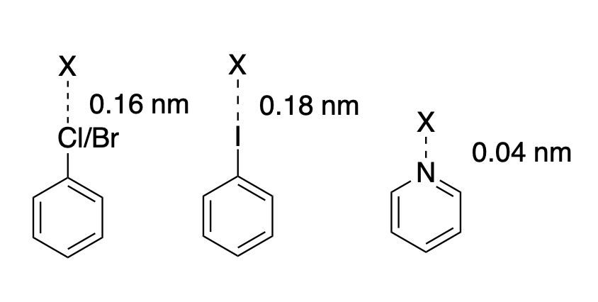

# 4. XML Format Force Field

DMFF utilizes XML format to describe force fields, which is compatitable with OpenMM. The design of such format is quite modular and convenient to use. Unfortunately, only limited documentations are available right now to explain the details of the file format. Here, the format and the meaning of the OpenMM XML file are sorted in details in below.

Overall speaking, the typification process is composed by the following steps:

1. Build the residue topology (draw all bonds) according to the residue name. This is done by matching the residue template in the topology file.

2. Match the residue topology with corresponding parameter templates.

3. Use the information in the matched parameter template to define the potential function. More specifically, go over all forces (i.e., potential components), and for each force (e.g., the bond stretching potential), match all terms (e.g., find all bonds) and register these terms in the total potential. 

The files involved in this process are introduced below.

## 4.1 Topology File

Bonding information is necessary for DMFF to assign force field parameters correctly. Such information can be either provided by the PDB file (in `CONECT` keyword) or by the topology file in XML format.

An example of the topology XML file of alanine is as follows:
```xml
<!-- residues.xml -->
<Residues>
    <Residue name="ALA">
        <Bond from="-C" to="N"/>
        <Bond from="C" to="CA"/>
        <Bond from="C" to="O"/>
        <Bond from="C" to="OXT"/>
        <Bond from="CA" to="CB"/>
        <Bond from="CA" to="HA"/>
        <Bond from="CA" to="N"/>
        <Bond from="CB" to="HB1"/>
        <Bond from="CB" to="HB2"/>
        <Bond from="CB" to="HB3"/>
        <Bond from="H" to="N"/>
        <Bond from="H2" to="N"/>
        <Bond from="H3" to="N"/>
        <Bond from="HXT" to="OXT"/>
    </Residue>
</Residues>
```

In the topology file, the chemical bonds are defined in residues and specified by the name of its consisting atoms. Note that here "-C" indicates an external bond between the "C" atom and the **previous** residue. The program (`openmm.topology` module) will first matching the residues in the provided structure with the residues defined in topology files by its residue name. Whenever a residue is matched, the program will then try to match all atoms in the topology template with the actual atoms in the real structure. Once a match is successful, the matched atom will be bonded accordingly. If the match fails, this template atom will be skipped. Therefore, the actual number of bonds in the matched structure can be less than the number of bonds defined in the template. It should also be noted that disulfide bonds are not registered in this step. The `openmm.topolgoy` will look for SG atoms in Cys that are not connected to HG, and connect SG atom pairs within 0.3 nm as disulfide bonds.

For common molecules such as water, protein, DNA and RNA, the topology files has been constructed and loaded internally, so the users do not need to provide an external one. But for other arbitrary molecules, such as a drug-like organic molecule, an external topology file is required to provide bonding information. Otherwise, users must load pdb files with correct bonding information which is specified by `CONECT` keyword.  

An external topology XML file is registered as:

``` python
import openmm.app as app
    
app.Topology.loadBondDefinations("topology.xml") # register residue topology
```

It should be awared that after this process, the bonding topologies are constructed for the matched residues in the given structure, but the force field parameters are not yet assigned, which is discussed in the next section.


## 4.2 Force Field Parameter File

The force field parameters are specified in a XML formatted force field parameter file. A sample force field file of water is given as follows:
``` xml
<!-- tip3p.xml -->
<ForceField>
    <Residues>
        <Residue name="HOH">
            <Atom name="O" type="spce-O" charge="-0.8476" />
            <Atom name="H1" type="spce-H" charge="0.4238" />
            <Atom name="H2" type="spce-H" charge="0.4238" />
            <Bond atomName1="O" atomName2="H1"/>
            <Bond atomName1="O" atomName2="H2"/>
        </Residue>
    </Residues>
    <AtomTypes>
        <Type name="spce-O" class="OW" element="O" mass="15.99943"/>
        <Type name="spce-H" class="HW" element="H" mass="1.007947"/>
    </AtomTypes>
    <HarmonicBondForce>
        <Bond class1="OW" class2="HW" length="0.1" k="462750.4"/>
    </HarmonicBondForce>
    <HarmonicAngleForce>
        <Angle class1="HW" class2="OW" class3="HW" angle="1.91061193216" k="836.8"/>
    </HarmonicAngleForce>
    <NonbondedForce coulomb14scale="0.833333" lj14scale="0.5">
        <UseAttributeFromResidue name="charge"/>
        <Atom type="spce-O" sigma="0.31657195050398818" epsilon="0.6497752"/>
        <Atom type="spce-H" sigma="1" epsilon="0"/>
    </NonbondedForce>
</ForceField>
```
The force field parameter file must have one root element `<ForceField></ForceField>` and can contain serveral children, which can be mainly divided into two parts: (1) residue part and (2) force field part. They are described in detail below.

### 4.2.1 Residue Part
The detailed description of this part can be found in the [OpenMM user guide](http://docs.openmm.org/latest/userguide/application/05_creating_ffs.html). Here we just provide a brief summary. 

The residue part refers to contents within the tag `<Residues>`, in which each residue template is defined in tag `<Residue>`. The residue template contain the following nodes:

+ `<Atom>`: specifies the name of the atom and its atom types, as well as some atom-level parameters (usually atomic 
+ `<Bond>`: specifies atom pairs that are bonded to each other.
+ `<ExternalBond>`: specified atoms that will be bonded to an atom of different residue, such as the amide bond between amino acid residues.
  
It should be clairfied that the bonding information contained in `<Bond>` tags may be different from that in the topology file. Take alanine (ALA) as an example, we usually have at least three states for ALA: at N-terminal, at C-terminal or inside chains. The corresponding parameter templates in the force field file are as follows:

``` xml
<Residue name="ALA">
  <Atom charge="-0.4157" name="N" type="protein-N"/>
  <Atom charge="0.2719" name="H" type="protein-H"/>
  <Atom charge="0.0337" name="CA" type="protein-CX"/>
  <Atom charge="0.0823" name="HA" type="protein-H1"/>
  <Atom charge="-0.1825" name="CB" type="protein-CT"/>
  <Atom charge="0.0603" name="HB1" type="protein-HC"/>
  <Atom charge="0.0603" name="HB2" type="protein-HC"/>
  <Atom charge="0.0603" name="HB3" type="protein-HC"/>
  <Atom charge="0.5973" name="C" type="protein-C"/>
  <Atom charge="-0.5679" name="O" type="protein-O"/>
  <Bond atomName1="N" atomName2="H"/>
  <Bond atomName1="N" atomName2="CA"/>
  <Bond atomName1="CA" atomName2="HA"/>
  <Bond atomName1="CA" atomName2="CB"/>
  <Bond atomName1="CA" atomName2="C"/>
  <Bond atomName1="CB" atomName2="HB1"/>
  <Bond atomName1="CB" atomName2="HB2"/>
  <Bond atomName1="CB" atomName2="HB3"/>
  <Bond atomName1="C" atomName2="O"/>
  <ExternalBond atomName="N"/>
  <ExternalBond atomName="C"/>
</Residue>
<Residue name="CALA">
  <Atom charge="-0.3821" name="N" type="protein-N"/>
  <Atom charge="0.2681" name="H" type="protein-H"/>
  <Atom charge="-0.1747" name="CA" type="protein-CX"/>
  <Atom charge="0.1067" name="HA" type="protein-H1"/>
  <Atom charge="-0.2093" name="CB" type="protein-CT"/>
  <Atom charge="0.0764" name="HB1" type="protein-HC"/>
  <Atom charge="0.0764" name="HB2" type="protein-HC"/>
  <Atom charge="0.0764" name="HB3" type="protein-HC"/>
  <Atom charge="0.7731" name="C" type="protein-C"/>
  <Atom charge="-0.8055" name="O" type="protein-O2"/>
  <Atom charge="-0.8055" name="OXT" type="protein-O2"/>
  <Bond atomName1="N" atomName2="H"/>
  <Bond atomName1="N" atomName2="CA"/>
  <Bond atomName1="CA" atomName2="HA"/>
  <Bond atomName1="CA" atomName2="CB"/>
  <Bond atomName1="CA" atomName2="C"/>
  <Bond atomName1="CB" atomName2="HB1"/>
  <Bond atomName1="CB" atomName2="HB2"/>
  <Bond atomName1="CB" atomName2="HB3"/>
  <Bond atomName1="C" atomName2="O"/>
  <Bond atomName1="C" atomName2="OXT"/>
  <ExternalBond atomName="N"/>
</Residue>
<Residue name="NALA">
  <Atom charge="0.1414" name="N" type="protein-N3"/>
  <Atom charge="0.1997" name="H1" type="protein-H"/>
  <Atom charge="0.1997" name="H2" type="protein-H"/>
  <Atom charge="0.1997" name="H3" type="protein-H"/>
  <Atom charge="0.0962" name="CA" type="protein-CX"/>
  <Atom charge="0.0889" name="HA" type="protein-HP"/>
  <Atom charge="-0.0597" name="CB" type="protein-CT"/>
  <Atom charge="0.03" name="HB1" type="protein-HC"/>
  <Atom charge="0.03" name="HB2" type="protein-HC"/>
  <Atom charge="0.03" name="HB3" type="protein-HC"/>
  <Atom charge="0.6163" name="C" type="protein-C"/>
  <Atom charge="-0.5722" name="O" type="protein-O"/>
  <Bond atomName1="N" atomName2="H1"/>
  <Bond atomName1="N" atomName2="H2"/>
  <Bond atomName1="N" atomName2="H3"/>
  <Bond atomName1="N" atomName2="CA"/>
  <Bond atomName1="CA" atomName2="HA"/>
  <Bond atomName1="CA" atomName2="CB"/>
  <Bond atomName1="CA" atomName2="C"/>
  <Bond atomName1="CB" atomName2="HB1"/>
  <Bond atomName1="CB" atomName2="HB2"/>
  <Bond atomName1="CB" atomName2="HB3"/>
  <Bond atomName1="C" atomName2="O"/>
  <ExternalBond atomName="C"/>
</Residue>
```

In this example, the atom numbers and the bonding configurations of ALA, CALA and NALA are different. When matching each ALA, OpenMM will try to match CALA, NALA, and ALA separately. It will compare each parameter template with the topology of the residue, and select the one with the exactly correct number of atoms, element composition, and bonding configurations as the matched template. The parameter template contains atom type and class information, which are then used to assign force field parameters.


### 4.2.2 Force Field Part

DMFF supports two scheme to assign force field parameters: atom typing scheme and SMIRKS-based scheme. The structure of force field file for these two schemes are generally similar but only has some slight different.

#### 4.2.2.1 Atom-typing Scheme
The atom-typing scheme is the most widely adopted way to assign parameters. In this scheme, the types of atoms are first defined and the parameters of bonds/angles/dihedrals are defined and assigned according to atom types. In OpenMM, the force field parameters are constructed in this scheme and DMFF provides a full support of this. Again, a detailed description of how to write and interpret this kind of force field file can also be found in the [OpenMM user guide](http://docs.openmm.org/latest/userguide/application/05_creating_ffs.html).

An example of TIP3P water parameters is provided:
```xml
<!-- tip3p.xml -->
<ForceField>
    ...
    <AtomTypes>
        <Type name="spce-O" class="OW" element="O" mass="15.99943"/>
        <Type name="spce-H" class="HW" element="H" mass="1.007947"/>
    </AtomTypes>
    <HarmonicBondForce>
        <Bond class1="OW" class2="HW" length="0.1" k="462750.4"/>
    </HarmonicBondForce>
    <HarmonicAngleForce>
        <Angle class1="HW" class2="OW" class3="HW" angle="1.91061193216" k="836.8"/>
    </HarmonicAngleForce>
    <NonbondedForce coulomb14scale="0.833333" lj14scale="0.5">
        <UseAttributeFromResidue name="charge"/>
        <Atom type="spce-O" sigma="0.31657195050398818" epsilon="0.6497752"/>
        <Atom type="spce-H" sigma="1" epsilon="0"/>
    </NonbondedForce>
</ForceField>
```

The `<AtomTypes>` node contain all atom types, each of which is defined in a child node `<Type>`. The `type` label of each atom in the residue part (i.e. `Residues/Residue/Atom`) will match the `name` label of `<Type>` . For each atom type, it also has a `class` tag for different a matching scenario, which is designed for situations where there are many rather similar atom types that can be grouped together for simplification. For example, in small molecular force fields (e.g. GAFF), the number of Lennard Jones (LJ) parameters are much more smaller than that of valence force parameters, such as dihedrals. We may need different atom types in order to specify these valence terms, but we can group the atom types with the same LJ parameters in to a certain "atom class" and this will simplify the definition of force field. Thus, be aware that the `name` tag of different `<Type>` nodes must be different, but the `class` tag can be the same.

The `<*Force>` nodes defines parameters as well as the matching rule of different types of interactions. For example, `<HarmonicBondForce>` defines harmonic bond, and the `<NonBondedForce>` node defines intermolecular interaction. In each kind of force, there are many children nodes and each of them define a specific type. In each type, several tags with name beginning with `type` or `class` define its consisting atoms, and also other necessary parameters to build the interaction. For instance, for `<HarmonicBondForce>`, there are many `<Bond>` nodes defining different bond types and in each node, `class1` and `class2` tags specify its consisting two atom classes (or `type1` and `type2` specify atom types) and `k`, `length` define its force constant (in kJ/mol/nm<sup>2</sup>) and equilibrium bond length (in nm) respcetively.

Again, for more information about each force, one can refer to the [OpenMM user guide](http://docs.openmm.org/latest/userguide/application/05_creating_ffs.html#writing-the-xml-file).

#### 4.2.2.2 SMIRKS-based Scheme

DMFF also supports assigning force field parameters with [SMIRKS](https://www.daylight.com/dayhtml/doc/theory/theory.smirks.html). SMIRKS is an extenstion of [SMARTS](https://www.daylight.com/dayhtml/doc/theory/theory.smarts.html) language which allows users not only to specify chemical substructures with certain patterns, but also to numerically tag the matched atoms for assigning parameters. 

An exmple force field based on SMIRKS for ethane molecule is as following:

```xml
<ForceField>
	<Residues>
		<Residue name="MOL">
			<Atom name="C1" type="C1" charge="-0.212000000"/>
			<Atom name="C2" type="C2" charge="-0.212000000"/>
			<Atom name="H1" type="H1" charge="0.071000000"/>
			<Atom name="H2" type="H2" charge="0.071000000"/>
			<Atom name="H3" type="H3" charge="0.071000000"/>
			<Atom name="H4" type="H4" charge="0.071000000"/>
			<Atom name="H5" type="H5" charge="0.071000000"/>
			<Atom name="H6" type="H6" charge="0.071000000"/>
			<Bond atomName1="C1" atomName2="C2"/>
			<Bond atomName1="C1" atomName2="H1"/>
			<Bond atomName1="C1" atomName2="H2"/>
			<Bond atomName1="C1" atomName2="H3"/>
			<Bond atomName1="C2" atomName2="H4"/>
			<Bond atomName1="C2" atomName2="H5"/>
			<Bond atomName1="C2" atomName2="H6"/>
		</Residue>
	</Residues>
	<AtomTypes>
		<Type class="c3" element="C" mass="12.010" name="C1"/>
		<Type class="c3" element="C" mass="12.010" name="C2"/>
		<Type class="hc" element="H" mass="1.008" name="H1"/>
		<Type class="hc" element="H" mass="1.008" name="H2"/>
		<Type class="hc" element="H" mass="1.008" name="H3"/>
		<Type class="hc" element="H" mass="1.008" name="H4"/>
		<Type class="hc" element="H" mass="1.008" name="H5"/>
		<Type class="hc" element="H" mass="1.008" name="H6"/>
	</AtomTypes>
	<HarmonicBondForce>
        <Bond k="100000.0000000000" length="0.1500000000" smirks="[#6:1]-[#6:1]"/>
		<Bond k="194560.0000000000" length="0.1538000000" smirks="[#6X4:1]-[#6X4:1]"/>
		<Bond k="314550.0000000001" length="0.1097000000" smirks="[#6X4:1]-[#1:2]"/>
	</HarmonicBondForce>
	<HarmonicAngleForce>
		<Angle angle="1.9163715187" k="391.6200000000" smirks="[#6X4:1]-[#6X4:2]-[#1:3]"/>
		<Angle angle="1.8776252093" k="326.3500000000" smirks="[#1:1]-[#6X4:2]-[#1:3]"/>
	</HarmonicAngleForce>
	<PeriodicTorsionForce ordering="amber">
		<Proper k1="0.5020800000" periodicity1="3" phase1="0.0000000000" smirks="[#1:1]-[#6X4:2]-[#6X4:3]-[#1:1]"/>
	</PeriodicTorsionForce>
	<NonbondedForce coulomb14scale="0.83333" lj14scale="0.50000">
		<UseAttributeFromResidue name="charge" />
		<Atom epsilon="0.4510350000" sigma="0.3397710000" smirks="[#6X4:1]"/>
		<Atom epsilon="0.0870272000" sigma="0.2600180000" smirks="[$([#1]-[#6X4]):1]"/>
		<BondChargeCorrection smirks="[#6X4:1]-[#6X4:2]" bcc="0.000" />
		<BondChargeCorrection smirks="[#6:1]-[#1:2]" bcc="0.000" />
		<BondChargeCorrection smirks="[#6X4:1]-[#1:2]" bcc="0.0393" />
	</NonbondedForce>
</ForceField>
```

The convention of this scheme in XML formatted force field is very similar with that of atom typing scheme, only replacing the `type` (or `class`) that specifying atom types with the tag `smirks`. Note that the `<Residues>` and `<AtomTypes>` nodes are also requires as DMFF needs them to search for atomic charge or element type, but the name of atomtypes are not used in matching interaction types.

In DMFF, SMIRKS patterns are matched sequentially, which means that during building each type of interaction, the program will try to match all the patterns defined in that force and assign parameters with the last matched pattern. Hence, users need to put patterns with more specificity behind the pattern with less specificty in order to assign the exact correct parameters. For example, in the example above, there are two similar smirks patterns in harmonic bonds: `"[#6:1]-[#6:1]"` and `"[#6X4:1]-[#6X4:1]"`. The program will finally use the latter one for ethane molecule, which is a more specifically-defined parameter than the former one.

SMIRKS-based scheme has two additional features that is not supported by atom typing scheme, bond charge corrections (BCC) and virtual site. They are defined with `<BondChargeCorrection>` and `<VirtualSite>` nodes respectively under `<NonbondedForce>`.

In `<BondChargeCorrection>`, a pattern matching two atoms is defined with `smirks` tag, and the partial charge of the first atom will be added with the correction value defined in tag `bcc` while the second atoms' charge will substract that value accordingly.

In `<VirtualSite>`, three tags are required: `smirks`, `vtype` and `distance`. The tag `smirks` specify the substructure pattern that virtual site is to be added, with the first atom as the parent atom of the virtual site. The tag `vtype` defines the type of the virtual site. Currently only two types are supported, which are along a bond (`"1"`) and along the bisector of an angle (`"2"`). The tag `distance` defines the distance between the virtual site and its parent atom, in nm.

The charge of the virtual site can only be specified by bond charge correction now. So the user needs to define corresponding BCC terms that can match atom with atomic number 0 (i.e. `"[#0]"`).

Here is an example of several virtual sites definitions and a graphical illustration:
```xml
<VirtualSite smirks="[#17,#35:1]-[#6X3;a:2]" vtype="1" distance="0.1600" />
<VirtualSite smirks="[#53:1]-[#6X3;a:2]" vtype="1" distance="0.1800" />
<VirtualSite smirks="[#7X2;a:1](:[*;a:2]):[*;a:3]" vtype="2" distance="0.0400" />
```



